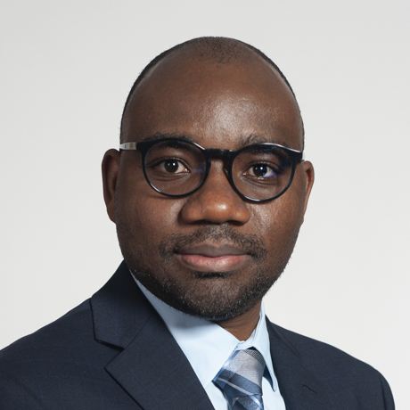

  

    
  

  

    

      My training began in chemistry, biochemistry, and molecular biology, where I learned to think about disease from the level of molecules, cells, pathways, and experimental systems. I later trained in biostatistics, bioinformatics, and computational biology to study those questions at the scale of modern molecular and clinical data.
    

    

      I am interested in how biological systems break down in disease: which molecular signals change, which mechanisms are involved, why patients differ, and how computational analysis can help identify biomarkers, patient subgroups, and testable therapeutic hypotheses.
    

    

      My work combines large-scale NGS, multi-omics integration, molecular signature discovery, statistical modeling, machine learning, computational method development, and mechanism-focused interpretation across human cohort and translational research settings.
    

  

## Scientific Background

I am a computational biologist and bioinformatics scientist with academic training across chemistry, biochemistry, molecular biology, biostatistics, bioinformatics, and computational biology. I earned my B.A. in Chemistry at Hendrix College, completed graduate training in biostatistics at the University of Arkansas for Medical Sciences, and completed my Ph.D. in Bioinformatics and Computational Biology at Indiana University Bloomington. I then pursued postdoctoral research in translational computational biology, multi-omics integration, molecular signature discovery, and computational method development at Massachusetts General Hospital, Harvard Medical School, and the Harvard T.H. Chan School of Public Health.

My earlier bench-based research in molecular biology, epigenetics, cancer biology, radiation biology, inflammatory signaling, and disease mechanisms gave me practical experience with experimental design, assay variability, molecular readouts, biological data generation, and mechanistic interpretation. That foundation remains central to how I approach computational work: I do not view analysis as simply processing data, but as a way to connect molecular measurements back to biological mechanisms and disease-relevant questions.

Across graduate and postdoctoral work, I have developed and applied computational methods, statistical models, machine-learning approaches, and reproducible workflows to large-scale NGS, multi-omic, clinical cohort, and high-dimensional molecular datasets. My goal is to generate interpretable results that help explain disease biology, identify molecular signatures and biomarkers, support patient stratification, and produce hypotheses that can be tested experimentally or clinically.

## Scientific & Computational Expertise

  

    <h3>Mechanism-Focused Disease Biology</h3>
    

      I use molecular, microbial, epigenetic, inflammatory, and clinical data to study disease-associated biological states and connect computational findings to mechanisms, pathways, and experimentally testable hypotheses.
    

  

  

    <h3>Human Cohort Multi-Omics</h3>
    

      I analyze large-scale human cohort datasets that combine molecular measurements with clinical context, using these data to identify disease-associated signatures, biomarkers, and biologically interpretable patterns.
    

  

  

    <h3>Computational Method Development</h3>
    

      I develop computational approaches for biological questions that are not fully addressed by standard workflows. One example is WAAFLE, a method for profiling lateral gene transfer directly from metagenomic data, developed through problem formulation, algorithm design, validation, and biological interpretation.
    

  

  

    <h3>Biomarkers &amp; Patient Stratification</h3>
    

      I use statistical modeling, feature selection, and machine learning to identify interpretable disease signatures and patient-relevant biological patterns, including a 21-species scoring index for active Clostridioides difficile infection and post-FMT monitoring.
    

  

  

    <h3>Experimental Context &amp; Biological Interpretation</h3>
    

      My bench-based research in molecular biology, epigenetics, radiation biology, cancer biology, inflammatory signaling, and lung disease helps me interpret computational results in light of experimental design, assay variability, molecular readouts, and biological mechanism.
    

  

  

    <h3>Reproducible Computational Workflows</h3>
    

      I build R, Python, Bash, Linux/Unix, and Git-based workflows for quality control, statistical modeling, machine learning, data integration, visualization, documentation, and scalable analysis in high-performance computing environments.
    

  

## Selected Areas of Focus

- Biology-grounded computational biology and bioinformatics
- Human disease mechanisms and molecular interpretation
- Chemistry, biochemistry, molecular biology, and experimental disease biology
- Biostatistics, cohort analysis, confounder-aware modeling, and quantitative interpretation
- Large-scale NGS, metagenomics, metatranscriptomics, and multi-omics integration
- Molecular signature discovery, biomarker analysis, and patient stratification
- Statistical modeling, machine learning, feature selection, and interpretable biological modeling
- Reproducible workflows, data quality control, documentation, and scientific visualization
- Cross-functional collaboration with experimental, clinical, computational, and data science teams
